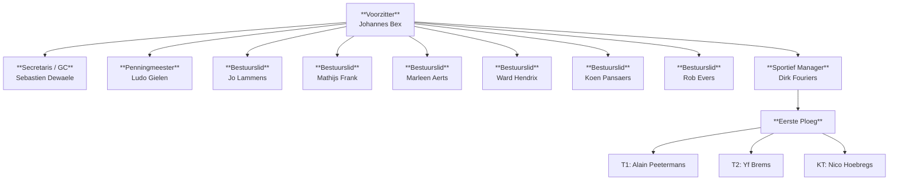

# Organogram FC Landen

```mermaid
flowchart TD
    VOZ["**Voorzitter**\nJohannes Bex"]
    GC["**Secretaris / GC**\nSebastien Dewaele"]
    PENN["**Penningmeester**\nLudo Gielen"]
    L1["**Bestuurslid**\nJo Lammens"]
    L2["**Bestuurslid**\nMathijs Frank"]
    L3["**Bestuurslid**\nMarleen Aerts"]
    L4["**Bestuurslid**\nWard Hendrix"]
    L5["**Bestuurslid**\nKoen Pansaers"]
    L6["**Bestuurslid**\nRob Evers"]
    SM["**Sportief Manager**\nDirk Fouriers"]
    P1["**Eerste Ploeg**"]
    T1["T1: Alain Peetermans"]
    T2["T2: Yf Brems"]
    KT["KT: Nico Hoebregs"]

    VOZ --> GC
    VOZ --> PENN
    VOZ --> L1
    VOZ --> L2
    VOZ --> L3
    VOZ --> L4
    VOZ --> L5
    VOZ --> L6
    VOZ --> SM
    SM --> P1
    P1 --> T1
    P1 --> T2
    P1 --> KT
```

---
