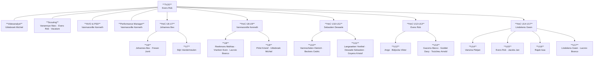

# Organogram Jeugd FC Landen

```mermaid
flowchart TD
    TVJO["**TVJO**\nEvers Rob"]
    VID["**Videoanalyst**\nUittebroek Michiel"]
    SCO["**Scouting**\nVananroye Marc · Evers Rob · Vacature"]
    AVO["**AV/O & PSD**\nVanmarsnille Kenneth"]
    PERF["**Performance Manager**\nVanmarsnille Kenneth"]

    HOC1["**HoC U6-U7**\nJohannes Bex"]
    HOC2["**HoC U8-U9**\nVanmarsnille Kenneth"]
    HOC3["**HoC U10-U11**\nSebastien Dewaele"]
    HOC4["**HoC U12-U13**\nEvers Rob"]
    HOC5["**HoC U14-U17**\nLindekens Gwen"]

    U6["**U6**\nJohannes Bex · Freson Jorrit"]
    U7["**U7**\nStijn Vandermeulen"]
    U8["**U8**\nReekmans Mathias · Vranken Sven · Lacroix Branco"]
    U9["**U9**\nPirlet Kristof · Uittebroek Michiel"]
    U10["**U10**\nVanmechelen Dietrich · Beckers Cedric"]
    U11["**U11**\nLangeaeken Yenthel · Dewaele Sebastien · Goyens Kristof"]
    U12["**U12**\nAnge · Bidjocka Viktor"]
    U13["**U13**\nGacoms Marco · Goddet Davy · Toctcheu Arnold"]
    U14["**U14**\nVansina Pietjan"]
    U15["**U15**\nEvers Rob · Jacobs Jan"]
    U16["**U16**\nRajab Issa"]
    U17["**U17**\nLindekens Gwen · Lacroix Branco"]

    TVJO --- VID
    TVJO --- SCO
    TVJO --- AVO
    TVJO --- PERF
    TVJO --> HOC1
    TVJO --> HOC2
    TVJO --> HOC3
    TVJO --> HOC4
    TVJO --> HOC5

    HOC1 --> U6
    HOC1 --> U7
    HOC2 --> U8
    HOC2 --> U9
    HOC3 --> U10
    HOC3 --> U11
    HOC4 --> U12
    HOC4 --> U13
    HOC5 --> U14
    HOC5 --> U15
    HOC5 --> U16
    HOC5 --> U17
```

---
